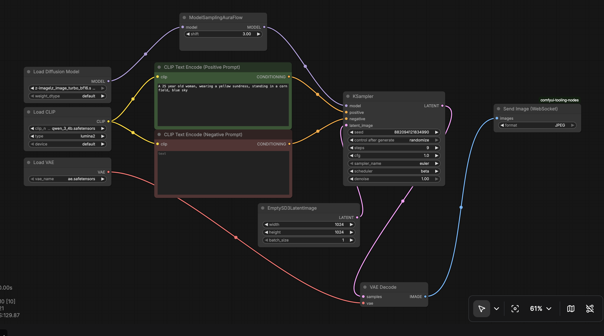
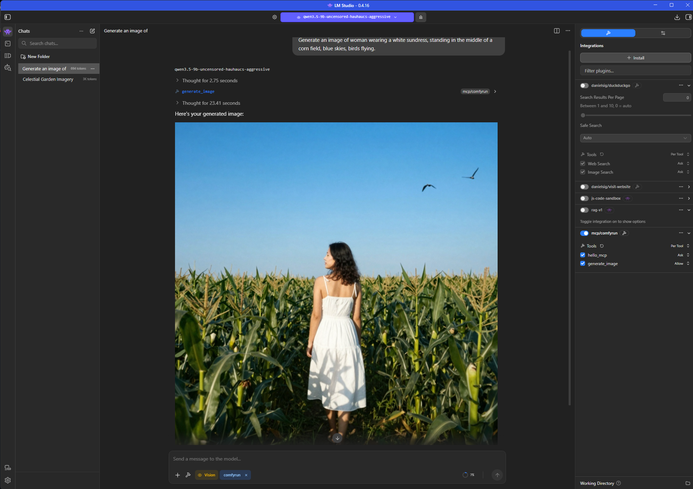

# ComfyRun

ComfyRun is a lightweight Python utility designed to execute ComfyUI workflows via its API and capture output images directly through WebSockets.

## Features

- **Workflow Execution**: Run ComfyUI API-format JSON workflows from the command line.
- **Real-time Monitoring**: Tracks the execution progress of nodes via WebSocket.
- **Automatic Image Capture**: Automatically captures image data sent via `ETN_SendImageWebSocket` (or compatible nodes) and saves them to the local filesystem.
- **Dynamic Format Support**: Detects the image format (e.g., png, jpg) from the workflow node configuration, defaulting to PNG.
- **Configurable Connection**: Ability to specify the ComfyUI server address and port.
- **Docker Support**: Easily deployable via Docker and Docker Compose.
- **MCP Server**: Can run as an MCP (Model Context Protocol) server providing tools for image generation.

## Project Structure

- `run_workflow.py`: The main entry point for command-line workflow execution.
- `comfy_mcp.py`: MCP server entry point providing image generation tools.
- `workflows/`: Directory to store your ComfyUI API JSON workflow files.
- `output/`: Directory where generated images are saved.
- `requirements.txt`: List of Python dependencies.
- `Dockerfile`: Docker configuration for containerization.
- `docker-compose.yml`: Docker Compose configuration for easy deployment.
- `.dockerignore`: Files to exclude from Docker build.

## Installation

### Prerequisites
- Python 3.x (for local installation)
- Docker and Docker Compose (for containerized deployment)
- A running instance of ComfyUI with the API enabled.
- The `ETN_SendImageWebSocket` node from [comfyui-tooling-nodes](https://github.com/Acly/comfyui-tooling-nodes) (or a compatible custom node that sends binary image data over WebSockets, just make sure to add the class_type to [image_node_class] in config for run_workflow).

### Local Setup
1. Clone the repository:
   ```bash
   git clone <repository-url>
   cd comfyrun
   ```

2. Install dependencies:
   ```bash
   pip install -r requirements.txt
   ```

### Docker Setup
1. Build and run with Docker Compose:
   ```bash
   docker-compose build
   docker-compose up -d  # Starts the MCP server in background
   ```

   Or build and run the Docker image directly:
   ```bash
   docker build -t comfyrun .
   docker run -d -p 8000:8000 -v $(pwd)/output:/app/output -v $(pwd)/workflows:/app/workflows comfyrun
   ```

## Usage

### Command Line Workflow Execution
Execute a workflow by providing the path to the API JSON file:

```bash
python run_workflow.py workflows/your_workflow.json
```

#### Options

| Argument | Description | Default |
|----------|-------------|---------|
| `workflow_path` | Path to the ComfyUI API JSON file | Required |
| `--server` | ComfyUI server IP or hostname | `127.0.0.1` |
| `--port` | ComfyUI server port | `8188` |

#### Example

To run a workflow on a remote server:
```bash
python run_workflow.py workflows/example_workflow_zit_t2i.json --server 192.168.1.100 --port 8188
```

## Image generation workflow example


#### Docker Example for Workflow Execution
```bash
docker-compose run comfyrun python run_workflow.py /app/workflows/example_workflow_zit_t2i.json --server host.docker.internal --port 8188
```

### MCP Server Mode
The Docker container is configured to run as an MCP server by default, providing two tools:

1. `hello_mcp`: A simple greeting tool to verify the server is online
2. `generate_image`: Generates an image using a ComfyUI workflow and a text prompt

#### Environment Variables
| Variable | Description | Default |
|----------|-------------|---------|
| `COMFY_SERVER` | ComfyUI server IP or hostname | `host.docker.internal` |
| `COMFY_PORT` | ComfyUI server port | `8188` |

#### Using MCP Tools
You can connect to the MCP server using any MCP client. Here's an example using a hypothetical MCP client:

```python
# Connect to the MCP server
client = MCPClient("http://localhost:8000")

# Test connection
result = client.call_tool("hello_mcp", {"name": "Alice"})
print(result)  # "Hello, Alice! The ComfyRun MCP server is online and working."

# Generate an image
image_result = client.call_tool("generate_image", {"prompt": "A beautiful sunset over mountains"})
# Returns an ImageContent object with base64-encoded image data
```

#### Docker Compose MCP Server
```bash
docker-compose up -d  # Starts MCP server accessible on port 8000
```

#### Direct Docker Run MCP Server
```bash
docker run -d -p 8000:8000 -v $(pwd)/output:/app/output -v $(pwd)/workflows:/app/workflows comfyrun
```

## LM Studio MCP Configuration

To use ComfyRun as an MCP server with LM Studio, create an `mcp.json` file in LM Studio's MCP configuration directory (usually `~/.lmstudio/mcp.json` or within the project). Example:

```json
{
  "servers": [
    {
      "name": "comfyrun",
      "url": "http://localhost:8000",
      "type": "http",
      "tools": [
        "hello_mcp",
        "generate_image"
      ]
    }
  ]
}
```

Make sure the ComfyRun MCP server is running (see MCP Server Mode section). Then LM Studio will be able to call the tools.

## LM Studio MCP Example


## Image Output

Images are saved in the `output/` folder using the following naming convention:
`output_{prompt_id}_{node_id}_{index}.{format}`

When using Docker, make sure to mount the output directory to persist your images:
```bash
docker run --rm -v $(pwd)/output:/app/output comfyrun ...
```

## License

Refer to the `LICENSE` file for licensing details.